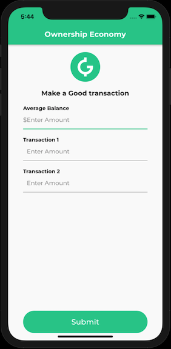
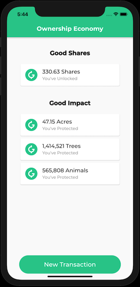

# positive_banking

**VSCode**

- Run `flutter pub get` to install packages
- Select a simulator
- Run `flutter run`

- A fake account is loaded with random numbers, but all inputs can be edited
- Max input is `10000.00`
- 2 decimals can be used, but are not required
- Using the `New Transaction` button will load a fresh account

   
